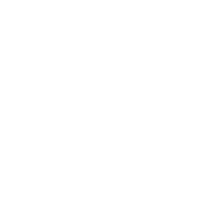

<center>

# M Y  B O X	

<br>



<br>
<br>

 

</center>

<br>

## Sobre

O MY BOX é um projeto de controle de estoque criado com React, utilizando a Framwork Tailwind para CSS e a biblioteca de componentes Daisy UI.

<br/>

****

<br/>

## Dependência

Nesse projeto foram utilizados os seguintes pacotes:

- **axios**: Para requisições a API REST
- **json-server**: Para simular um backend com banco de dados
- **react-cookie**: Para manipulação dos cookies do navegador (Utilizado para salvar o token de acesso do usuário)
- **react-hot-toast**: Para utilização de notificações Toast na aplicação
- **react-icons**: Para utilização de icones
- **react-router-dom**: Para utilização de rotas
  
<br/>

# Como iniciar o projeto

## 1. Instalar as dependências

```console
user@user:~$ yarn install
```

<br/>

## 2. Iniciar o projeto (Desenvolvimento)

```console
user@user:~$ yarn start
```

<br/>

## 3. Iniciar o json-server

```console
user@user:~$ json-server -p 3001 --watch db.json
```

<br/>

## Build (Produção)

Para realizar o build do projeto utilize o comando abaixo

```console
user@user:~$ yarn build
```

<br/>

# Configurando End-Point

Para configurar o end-point do projeto basta mudar o arquivo env.js localizado na pasta src/helpers, e apontar para o end-point gerado pelo json-server na etapa 3.

<br>
<br>


<center>
    
# Obrigado por visitar ! 

## Esse projeto foi criado com muito ❤️ e ☕ por Igor Flores

</center>

<br>

contato: dev.igorflores@gmail.com

